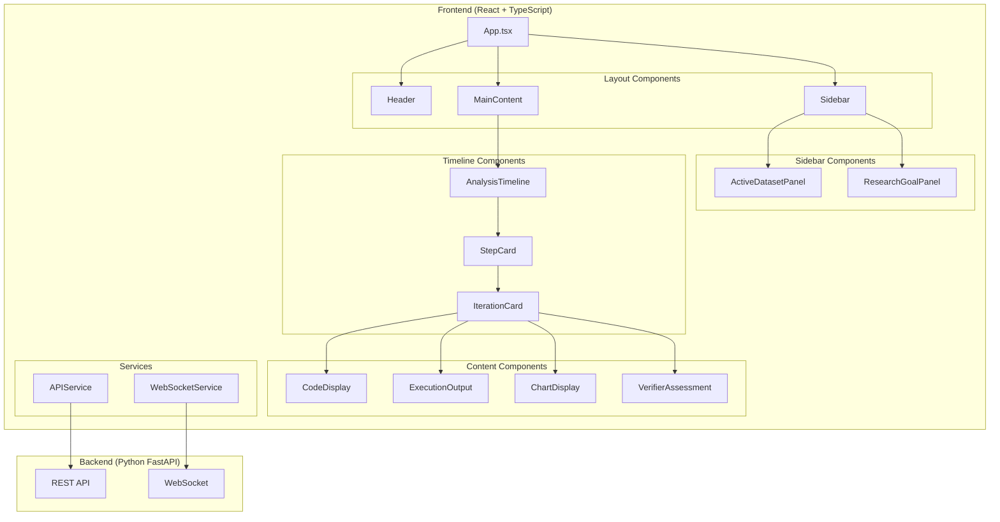

# DS-STAR Workbench Frontend Design

## Overview

This design document describes the frontend architecture for the DS-STAR Workbench - a modern React-based UI for the DS-Star multi-agent data science system. The interface transforms CLI interactions into a beautiful, iterative workflow with real-time streaming, code display, visualizations, and verification steps.

## Architecture



## Component Hierarchy

```
App
├── Header
│   ├── Logo
│   ├── Title
│   └── ConnectionStatus
├── Sidebar
│   ├── ActiveDatasetPanel
│   │   ├── DatasetInfo
│   │   └── ColumnPills
│   └── ResearchGoalPanel
│       ├── GoalTextArea
│       ├── StartAnalysisButton
│       └── ExploreButton
└── MainContent
    └── AnalysisTimeline
        ├── TimelineHeader (step count)
        └── StepCard[]
            ├── StepHeader
            └── IterationCard[]
                ├── IterationHeader (description + verified badge)
                ├── CodeDisplay
                ├── ExecutionOutput
                ├── ChartDisplay
                └── VerifierAssessment
                    ├── AssessmentText
                    ├── ApproveButton
                    └── DeclineButton
```

## Data Models

```typescript
// Analysis state
interface AnalysisState {
  id: string;
  researchGoal: string;
  dataset: DatasetInfo;
  steps: AnalysisStep[];
  status: 'idle' | 'running' | 'completed' | 'error';
  startedAt: Date;
  completedAt?: Date;
}

interface DatasetInfo {
  filename: string;
  description: string;
  columns: ColumnInfo[];
  rowCount: number;
}

interface ColumnInfo {
  name: string;
  dtype: string;
}

interface AnalysisStep {
  id: string;
  stepNumber: number;
  iterations: Iteration[];
  status: 'pending' | 'running' | 'completed';
}

interface Iteration {
  id: string;
  iterationNumber: number;
  timestamp: Date;
  description: string;
  generatedCode: string;
  executionOutput: ExecutionResult;
  visualization?: ChartSpec;
  verification: VerificationResult;
  status: 'pending' | 'generating' | 'executing' | 'verifying' | 'verified' | 'failed';
}

interface ExecutionResult {
  success: boolean;
  output: string;
  error?: string;
  duration_ms: number;
}

interface ChartSpec {
  chart_type: string;
  title: string;
  plotly_json: any;
}

interface VerificationResult {
  passed: boolean;
  assessment: string;
  suggestions?: string[];
}
```

## Styling System

### Color Palette

```css
:root {
  /* Primary colors */
  --color-primary: #6366f1;        /* Indigo - brand color */
  --color-primary-dark: #4f46e5;
  
  /* Semantic colors */
  --color-success: #22c55e;        /* Green - approve, verified */
  --color-error: #ef4444;          /* Red - decline, error */
  --color-warning: #f59e0b;        /* Amber - warning */
  
  /* Neutral colors */
  --color-bg-dark: #1e1b4b;        /* Dark indigo - sidebar */
  --color-bg-light: #f8fafc;       /* Light gray - main content */
  --color-bg-card: #ffffff;        /* White - cards */
  --color-text-primary: #1e293b;   /* Dark slate - headings */
  --color-text-secondary: #64748b; /* Slate - body text */
  --color-border: #e2e8f0;         /* Light border */
  
  /* Code colors */
  --color-code-bg: #1e293b;        /* Dark background for code */
  --color-code-text: #e2e8f0;      /* Light text for code */
}
```

### Component Styles

```css
/* Cards */
.card {
  background: var(--color-bg-card);
  border-radius: 8px;
  box-shadow: 0 1px 3px rgba(0, 0, 0, 0.1);
  padding: 16px;
}

/* Buttons */
.btn-primary {
  background: var(--color-success);
  color: white;
  border-radius: 6px;
  padding: 12px 24px;
  font-weight: 600;
  transition: all 150ms ease;
}

.btn-secondary {
  background: transparent;
  color: var(--color-primary);
  border: 1px solid var(--color-primary);
  border-radius: 6px;
  padding: 12px 24px;
}

/* Pills/Tags */
.pill {
  background: var(--color-bg-light);
  border: 1px solid var(--color-border);
  border-radius: 16px;
  padding: 4px 12px;
  font-size: 12px;
}
```

## API Integration

### REST Endpoints

```typescript
// GET /api/status
interface StatusResponse {
  status: 'ready' | 'initializing' | 'error';
  model: string;
  region: string;
  specialists: string[];
  data_loaded: boolean;
  dataset_info?: DatasetInfo;
}

// POST /api/analyze
interface AnalyzeRequest {
  research_goal: string;
  dataset_path?: string;
}

interface AnalyzeResponse {
  analysis_id: string;
  status: 'started';
}

// GET /api/analysis/:id
interface AnalysisResponse {
  id: string;
  status: string;
  steps: AnalysisStep[];
}
```

### WebSocket Events

```typescript
// Client -> Server
interface StartAnalysisEvent {
  type: 'start_analysis';
  research_goal: string;
}

interface ApproveStepEvent {
  type: 'approve_step';
  step_id: string;
}

interface RefineStepEvent {
  type: 'refine_step';
  step_id: string;
  feedback: string;
}

// Server -> Client
interface CodeGeneratedEvent {
  type: 'code_generated';
  step_id: string;
  iteration_id: string;
  code: string;
}

interface ExecutionCompleteEvent {
  type: 'execution_complete';
  step_id: string;
  iteration_id: string;
  output: ExecutionResult;
}

interface VisualizationReadyEvent {
  type: 'visualization_ready';
  step_id: string;
  iteration_id: string;
  chart: ChartSpec;
}

interface VerificationCompleteEvent {
  type: 'verification_complete';
  step_id: string;
  iteration_id: string;
  result: VerificationResult;
}
```

## Testing Strategy

### Unit Tests
- Component rendering tests with React Testing Library
- Service function tests with mocked fetch/WebSocket

### Integration Tests
- Full workflow tests with MSW (Mock Service Worker)
- WebSocket event handling tests

### E2E Tests
- Playwright tests for critical user flows
- Visual regression tests for UI consistency

