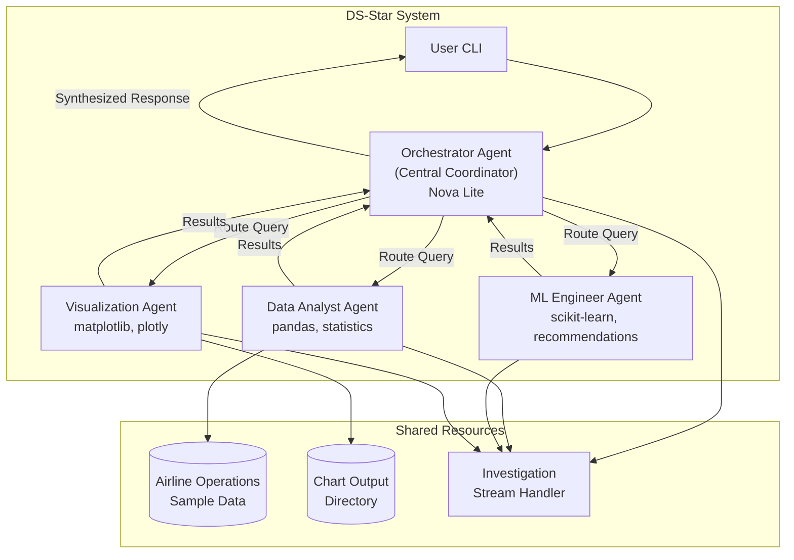

# DS-Star Multi-Agent System Design

## Overview

This design document describes the implementation of Google's DS-Star (Data Science Star) multi-agent framework using the AWS Strands Agents SDK with Amazon Nova Lite. The system implements a star topology where a central Orchestrator Agent coordinates three specialist agents (Data Analyst, ML Engineer, Visualization Expert) to solve data science queries using sample airline operations data.

The implementation prioritizes:
- **Local demo execution** for stakeholder presentations
- **Real-time investigation streaming** showing all reasoning steps
- **Chart-ready JSON output** for future UI integration
- **Extensibility** for adding future specialist agents

## Architecture



### Star Topology Pattern

The DS-Star architecture follows the "Agent-as-Tool" pattern from Strands SDK:

1. **Orchestrator Agent**: Central coordinator that receives all user queries, analyzes intent, routes to appropriate specialists, and synthesizes final responses
2. **Specialist Agents**: Domain experts wrapped as tools, each with focused system prompts and specialized tool sets
3. **Shared State**: Conversation history and context passed via `invocation_state` to maintain coherence across agent interactions

## Components and Interfaces

### 1. Main Entry Point (`main.py`)

```python
# Responsibilities:
# - Parse CLI arguments and load configuration
# - Initialize the DS-Star system
# - Run the interactive query loop
# - Handle graceful shutdown

class DSStarCLI:
    def __init__(self, config: Config)
    def run(self) -> None
    def process_query(self, query: str) -> str
    def shutdown(self) -> None
```

### 2. Configuration Module (`config.py`)

```python
@dataclass
class Config:
    model_id: str = "us.amazon.nova-lite-v1:0"
    region: str = "us-west-2"
    verbose: bool = False
    max_tokens: int = 4096
    temperature: float = 0.3
    output_dir: str = "./output"
    data_path: str = "./data/airline_operations.csv"
    
    @classmethod
    def from_env(cls) -> "Config"
    
    @classmethod
    def from_file(cls, path: str) -> "Config"
```

### 3. Orchestrator Agent (`agents/orchestrator.py`)

```python
class OrchestratorAgent:
    """Central coordinator implementing DS-Star hub."""
    
    def __init__(
        self,
        model: BedrockModel,
        specialists: List[Callable],
        stream_handler: InvestigationStreamHandler,
        config: Config
    )
    
    def process(self, query: str, context: Optional[Dict] = None) -> AgentResponse
    
    def _route_query(self, query: str) -> List[str]  # Returns specialist names
    
    def _synthesize_responses(self, responses: List[SpecialistResponse]) -> str
```

### 4. Specialist Agents (`agents/specialists/`)

#### Data Analyst Agent (`data_analyst.py`)

```python
@tool
def data_analyst(query: str) -> str:
    """
    Process data analysis queries on airline operations data.
    Handles: statistical analysis, data exploration, KPI calculations,
    trend analysis, and data quality assessment.
    
    Args:
        query: The data analysis question or task
    """
```

#### ML Engineer Agent (`ml_engineer.py`)

```python
@tool
def ml_engineer(query: str) -> str:
    """
    Process machine learning queries for airline operations.
    Handles: model recommendations, algorithm selection, feature engineering
    suggestions, and code generation for ML pipelines.
    
    Args:
        query: The ML-related question or task
    """
```

#### Visualization Agent (`visualization_expert.py`)

```python
@tool
def visualization_expert(query: str) -> str:
    """
    Create visualizations for airline operations data.
    Handles: chart recommendations, matplotlib/plotly code generation,
    and chart specification JSON output for UI integration.
    
    Args:
        query: The visualization request or question
    """
```

### 5. Investigation Stream Handler (`handlers/stream_handler.py`)

```python
class InvestigationStreamHandler(CallbackHandler):
    """Streams all reasoning steps, tool calls, and results in real-time."""
    
    def __init__(self, verbose: bool = False)
    
    def on_agent_start(self, agent_name: str, query: str) -> None
    def on_routing_decision(self, specialist: str, reasoning: str) -> None
    def on_tool_start(self, tool_name: str, inputs: Dict) -> None
    def on_tool_end(self, tool_name: str, result: Any) -> None
    def on_agent_end(self, agent_name: str, response: str) -> None
    def on_error(self, error: Exception, context: str) -> None
```

### 6. Chart Output Handler (`handlers/chart_handler.py`)

```python
@dataclass
class ChartSpecification:
    chart_type: str  # "bar", "line", "scatter", "pie", etc.
    title: str
    data: List[Dict]
    x_axis: Optional[AxisConfig]
    y_axis: Optional[AxisConfig]
    styling: Dict
    plotly_json: Dict  # For web rendering
    matplotlib_code: str  # For local rendering

class ChartOutputHandler:
    def __init__(self, output_dir: str)
    def save_chart_spec(self, spec: ChartSpecification, filename: str) -> str
    def generate_plotly_json(self, spec: ChartSpecification) -> Dict
```

### 7. Airline Data Module (`data/airline_data.py`)

```python
class AirlineDataLoader:
    """Loads and provides access to sample airline operations data."""
    
    def __init__(self, data_path: str)
    def load(self) -> pd.DataFrame
    def get_schema(self) -> Dict[str, str]
    def get_sample(self, n: int = 5) -> pd.DataFrame
    
@tool
def query_airline_data(query: str) -> str:
    """
    Execute pandas operations on airline operations dataset.
    Available columns: flight_id, airline, origin, destination, 
    scheduled_departure, actual_departure, delay_minutes, delay_cause,
    load_factor, turnaround_minutes, cancelled, date.
    
    Args:
        query: Natural language description of the data query
    """
```

## Data Models

### Airline Operations Dataset Schema

```python
@dataclass
class FlightRecord:
    flight_id: str
    airline: str  # "AA", "UA", "DL", "SW", "JB"
    origin: str  # Airport code
    destination: str  # Airport code
    scheduled_departure: datetime
    actual_departure: Optional[datetime]
    delay_minutes: int
    delay_cause: Optional[str]  # "weather", "mechanical", "crew", "traffic", "security"
    load_factor: float  # 0.0 to 1.0
    turnaround_minutes: int
    cancelled: bool
    date: date
```

### Agent Response Models

```python
@dataclass
class SpecialistResponse:
    agent_name: str
    query: str
    response: str
    tool_calls: List[ToolCall]
    execution_time_ms: int
    
@dataclass
class AgentResponse:
    query: str
    routing: List[str]  # Specialists invoked
    specialist_responses: List[SpecialistResponse]
    synthesized_response: str
    charts: List[ChartSpecification]
    total_time_ms: int

@dataclass
class ToolCall:
    tool_name: str
    inputs: Dict
    output: Any
    duration_ms: int
```

### Configuration Models

```python
@dataclass
class Config:
    model_id: str
    region: str
    verbose: bool
    max_tokens: int
    temperature: float
    output_dir: str
    data_path: str
    retry_attempts: int = 3
    retry_delay_base: float = 1.0
```


## Correctness Properties

*A property is a characteristic or behavior that should hold true across all valid executions of a system-essentially, a formal statement about what the system should do. Properties serve as the bridge between human-readable specifications and machine-verifiable correctness guarantees.*

### Property 1: Query Routing Correctness

*For any* user query containing domain-specific keywords (data analysis, ML, visualization), the Orchestrator Agent should route to the specialist agent whose domain matches those keywords.

**Validates: Requirements 2.1**

### Property 2: Multi-Domain Query Handling

*For any* user query that contains keywords from multiple specialist domains, the Orchestrator Agent should invoke all relevant specialists in sequence and collect responses from each.

**Validates: Requirements 2.2**

### Property 3: Context Propagation to Specialists

*For any* routing decision, the specialist agent should receive both the original query and any relevant conversation context from the shared state.

**Validates: Requirements 2.3, 6.2**

### Property 4: Response Synthesis Completeness

*For any* set of specialist responses, the Orchestrator Agent should produce a synthesized response that incorporates information from all invoked specialists.

**Validates: Requirements 2.4**

### Property 5: Specialist Response Structure

*For any* specialist agent invocation (Data Analyst, ML Engineer, or Visualization Expert), the response should conform to the SpecialistResponse dataclass structure with all required fields populated.

**Validates: Requirements 3.4, 4.4, 5.4**

### Property 6: Code Generation Validity

*For any* request that triggers code generation (ML code or visualization code), the generated Python code should be syntactically valid and parseable by the Python AST module.

**Validates: Requirements 4.3, 5.2**

### Property 7: Conversation History Maintenance

*For any* sequence of N queries in a session, the conversation history should contain exactly N query-response pairs, preserving chronological order.

**Validates: Requirements 6.1**

### Property 8: Context Size Management

*For any* conversation context, the total token count passed to specialists should not exceed the configured max_tokens limit, with truncation preserving the most recent entries.

**Validates: Requirements 6.3**

### Property 9: Investigation Stream Completeness

*For any* query processing, the investigation stream should emit events in order: agent_start → routing_decision → tool_start → tool_end → agent_end, with each event containing required metadata (agent name, tool name, inputs, outputs as applicable).

**Validates: Requirements 7.1, 7.2, 7.3, 7.4, 11.1, 11.2, 11.3, 11.4**

### Property 10: Retry Logic Correctness

*For any* transient Bedrock API failure, the system should retry with exponential backoff (delay = base * 2^attempt) up to 3 attempts before failing.

**Validates: Requirements 8.1**

### Property 11: Error Handling Fallback

*For any* specialist agent error, the Orchestrator should catch the exception and return a fallback response rather than propagating the error to the user.

**Validates: Requirements 8.2**

### Property 12: Token Limit Truncation

*For any* context that exceeds token limits, truncation should preserve the most recent conversation entries and the current query, removing older entries first.

**Validates: Requirements 8.3**

### Property 13: Configuration Loading

*For any* valid configuration source (environment variables or config file), the Config object should be populated with all specified values, with environment variables taking precedence over file values.

**Validates: Requirements 9.1**

### Property 14: Verbose Mode Output

*For any* query processed with verbose=True, the investigation stream should include detailed reasoning steps and tool call parameters that are omitted when verbose=False.

**Validates: Requirements 9.2, 7.3**

### Property 15: Model Selection from Config

*For any* Config with a specified model_id, the BedrockModel instance should be initialized with that exact model_id.

**Validates: Requirements 9.3**

### Property 16: Configuration Defaults

*For any* invalid or missing configuration value, the system should use the defined default value and log a warning message.

**Validates: Requirements 9.4**

### Property 17: Dataset Schema Validation

*For any* loaded airline dataset, the DataFrame should contain all required columns (flight_id, airline, origin, destination, delay_minutes, delay_cause, load_factor, turnaround_minutes, cancelled, date) with appropriate data types.

**Validates: Requirements 10.2, 10.3**

### Property 18: Chart Specification Structure

*For any* chart generated by the Visualization Agent, the ChartSpecification should contain all required fields: chart_type, title, data, and styling, with chart_type being one of the valid types (bar, line, scatter, pie, histogram).

**Validates: Requirements 12.1, 12.2**

### Property 19: Dual Chart Format Output

*For any* chart specification, both matplotlib_code (valid Python string) and plotly_json (valid JSON object) should be populated and represent the same visualization.

**Validates: Requirements 12.3**

### Property 20: Chart File Persistence

*For any* chart specification saved via ChartOutputHandler, a JSON file should be created in the output directory with the correct filename and valid JSON content.

**Validates: Requirements 12.4**

## Error Handling

### API Errors

```python
class BedrockRetryHandler:
    """Handles transient Bedrock API failures with exponential backoff."""
    
    def __init__(self, max_attempts: int = 3, base_delay: float = 1.0):
        self.max_attempts = max_attempts
        self.base_delay = base_delay
    
    async def execute_with_retry(self, func: Callable) -> Any:
        for attempt in range(self.max_attempts):
            try:
                return await func()
            except (ThrottlingException, ServiceUnavailableException) as e:
                if attempt == self.max_attempts - 1:
                    raise
                delay = self.base_delay * (2 ** attempt)
                await asyncio.sleep(delay)
```

### Specialist Agent Errors

```python
def safe_specialist_call(specialist_func: Callable, query: str) -> SpecialistResponse:
    """Wraps specialist calls with error handling."""
    try:
        return specialist_func(query)
    except Exception as e:
        logger.error(f"Specialist error: {e}")
        return SpecialistResponse(
            agent_name=specialist_func.__name__,
            query=query,
            response=f"I encountered an issue processing this request. Please try rephrasing your question.",
            tool_calls=[],
            execution_time_ms=0
        )
```

### Token Limit Handling

```python
def truncate_context(context: List[Dict], max_tokens: int) -> List[Dict]:
    """Truncates conversation context to fit within token limits."""
    # Always keep the most recent query
    # Remove oldest entries first
    # Estimate tokens using tiktoken or simple heuristic (4 chars ≈ 1 token)
```

## Testing Strategy

### Dual Testing Approach

This system uses both unit tests and property-based tests for comprehensive coverage:

- **Unit tests**: Verify specific examples, edge cases, and integration points
- **Property-based tests**: Verify universal properties that should hold across all inputs

### Property-Based Testing Framework

**Framework**: `hypothesis` (Python)

```bash
pip install hypothesis
```

**Configuration**: Each property test runs a minimum of 100 iterations.

**Annotation Format**: Each property test is tagged with:
```python
# **Feature: ds-star-multi-agent, Property {number}: {property_text}**
```

### Test Categories

#### 1. Routing Logic Tests

- Property tests for query classification accuracy
- Unit tests for edge cases (ambiguous queries, empty queries)

#### 2. Agent Integration Tests

- Property tests for response structure validation
- Unit tests for specific specialist behaviors

#### 3. Stream Handler Tests

- Property tests for event ordering and completeness
- Unit tests for verbose vs. non-verbose output

#### 4. Configuration Tests

- Property tests for config loading from multiple sources
- Unit tests for default value fallbacks

#### 5. Data Handling Tests

- Property tests for dataset schema validation
- Unit tests for data loading edge cases

#### 6. Chart Output Tests

- Property tests for chart specification structure
- Property tests for dual format generation
- Unit tests for file persistence

### Example Property Test

```python
from hypothesis import given, strategies as st, settings

# **Feature: ds-star-multi-agent, Property 6: Code Generation Validity**
@settings(max_examples=100)
@given(st.sampled_from(["create a bar chart", "plot the trend", "visualize delays"]))
def test_code_generation_validity(query: str):
    """Generated Python code should be syntactically valid."""
    response = visualization_expert(query)
    
    # Extract code from response
    code = extract_code_block(response)
    
    # Verify syntactic validity
    import ast
    ast.parse(code)  # Raises SyntaxError if invalid
```

### Test File Structure

```
tests/
├── unit/
│   ├── test_config.py
│   ├── test_orchestrator.py
│   ├── test_specialists.py
│   ├── test_stream_handler.py
│   └── test_chart_handler.py
├── property/
│   ├── test_routing_properties.py
│   ├── test_response_properties.py
│   ├── test_stream_properties.py
│   ├── test_config_properties.py
│   └── test_chart_properties.py
└── integration/
    └── test_end_to_end.py
```
