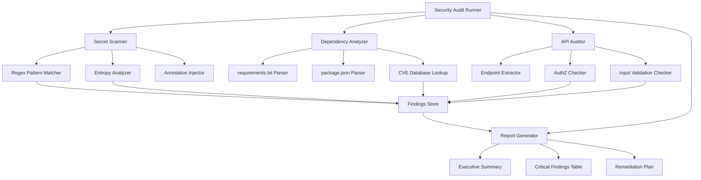

# Design Document: Security Audit & Hardening

## Overview

This design document outlines the architecture and implementation approach for a comprehensive security audit and hardening system. The system will scan the codebase for security vulnerabilities using static analysis patterns, cross-reference dependencies against CVE databases, analyze API endpoints for OWASP Top 10 vulnerabilities, and generate a detailed security audit report.

The implementation uses Python scripts with regex-based pattern matching for secret detection, pip-audit/npm-audit for dependency scanning, and custom AST-based analysis for API endpoint security review.

## Architecture



## Components and Interfaces

### 1. Security Scanner Module (`security_scanner.py`)

The main orchestrator that coordinates all scanning phases.

```python
class SecurityScanner:
    def __init__(self, root_path: str):
        self.root_path = root_path
        self.findings: List[SecurityFinding] = []
        self.secret_scanner = SecretScanner()
        self.dependency_analyzer = DependencyAnalyzer()
        self.api_auditor = APIAuditor()
        self.report_generator = ReportGenerator()
    
    def run_full_audit(self) -> AuditReport:
        """Execute all scanning phases and generate report."""
        pass
    
    def scan_secrets(self) -> List[SecretFinding]:
        """Scan for hardcoded secrets."""
        pass
    
    def analyze_dependencies(self) -> List[DependencyFinding]:
        """Analyze dependencies for CVEs."""
        pass
    
    def audit_api_endpoints(self) -> List[APIFinding]:
        """Audit API endpoints for OWASP vulnerabilities."""
        pass
```

### 2. Secret Scanner Module (`secret_scanner.py`)

Detects hardcoded secrets using regex patterns and entropy analysis.

```python
# Regex patterns for secret detection
SECRET_PATTERNS = {
    "api_key": [
        r'(?i)(api[_-]?key|apikey)\s*[=:]\s*["\']?([a-zA-Z0-9_\-]{20,})["\']?',
        r'(?i)x-api-key\s*[=:]\s*["\']?([a-zA-Z0-9_\-]{20,})["\']?',
    ],
    "aws_credentials": [
        r'(?i)(aws[_-]?access[_-]?key[_-]?id)\s*[=:]\s*["\']?(AKIA[A-Z0-9]{16})["\']?',
        r'(?i)(aws[_-]?secret[_-]?access[_-]?key)\s*[=:]\s*["\']?([a-zA-Z0-9/+=]{40})["\']?',
    ],
    "generic_secret": [
        r'(?i)(password|passwd|pwd|secret|token)\s*[=:]\s*["\']?([^\s"\']{8,})["\']?',
    ],
    "private_key": [
        r'-----BEGIN\s+(RSA\s+)?PRIVATE\s+KEY-----',
        r'-----BEGIN\s+OPENSSH\s+PRIVATE\s+KEY-----',
    ],
    "jwt_token": [
        r'eyJ[a-zA-Z0-9_-]*\.eyJ[a-zA-Z0-9_-]*\.[a-zA-Z0-9_-]*',
    ],
    "connection_string": [
        r'(?i)(mongodb|postgres|mysql|redis)://[^\s"\']+',
        r'(?i)Data\s+Source=[^;]+;.*Password=[^;]+',
    ],
}

# Files/directories to exclude from scanning
EXCLUDE_PATTERNS = [
    r'\.git/',
    r'node_modules/',
    r'\.venv/',
    r'__pycache__/',
    r'\.env\.example$',  # Example files are OK
    r'\.md$',  # Documentation files
    r'\.lock$',  # Lock files
]

class SecretScanner:
    def scan_file(self, file_path: str) -> List[SecretFinding]:
        """Scan a single file for secrets."""
        pass
    
    def mask_secret(self, secret: str) -> str:
        """Mask a secret value for safe logging."""
        # Show first 4 and last 2 chars: "sk-abc...xy"
        if len(secret) <= 8:
            return "*" * len(secret)
        return f"{secret[:4]}...{secret[-2:]}"
    
    def add_security_annotation(self, file_path: str, line_number: int) -> bool:
        """Add TODO: SECURITY CRITICAL comment to file."""
        pass
```

### 3. Dependency Analyzer Module (`dependency_analyzer.py`)

Analyzes project dependencies for known vulnerabilities.

```python
class DependencyAnalyzer:
    def parse_requirements_txt(self, path: str) -> List[Dependency]:
        """Parse Python requirements.txt file."""
        pass
    
    def parse_package_json(self, path: str) -> List[Dependency]:
        """Parse Node.js package.json file."""
        pass
    
    def check_cve_database(self, package: str, version: str) -> List[CVERecord]:
        """Check package against CVE database using pip-audit/npm-audit."""
        pass
    
    def get_safe_version(self, package: str, current_version: str) -> Optional[str]:
        """Get recommended safe version for vulnerable package."""
        pass
```

### 4. API Auditor Module (`api_auditor.py`)

Analyzes API endpoints for OWASP Top 10 vulnerabilities.

```python
# Patterns for detecting API endpoints
ENDPOINT_PATTERNS = {
    "fastapi": [
        r'@app\.(get|post|put|delete|patch)\s*\(\s*["\']([^"\']+)["\']',
        r'@router\.(get|post|put|delete|patch)\s*\(\s*["\']([^"\']+)["\']',
    ],
    "flask": [
        r'@app\.route\s*\(\s*["\']([^"\']+)["\']',
        r'@blueprint\.route\s*\(\s*["\']([^"\']+)["\']',
    ],
    "express": [
        r'app\.(get|post|put|delete|patch)\s*\(\s*["\']([^"\']+)["\']',
        r'router\.(get|post|put|delete|patch)\s*\(\s*["\']([^"\']+)["\']',
    ],
}

# Patterns indicating missing authorization
AUTHZ_INDICATORS = [
    r'Depends\s*\(\s*get_current_user',  # FastAPI auth dependency
    r'@login_required',  # Flask-Login
    r'@jwt_required',  # Flask-JWT
    r'authenticate',  # Generic auth middleware
    r'authorization',  # Auth header check
    r'verify_token',  # Token verification
]

# Patterns indicating unvalidated input (potential injection)
INJECTION_RISK_PATTERNS = [
    r'request\.(args|form|json|data)\s*\[',  # Direct access without validation
    r'f["\'].*\{.*request\.',  # f-string with request data
    r'\.format\(.*request\.',  # .format() with request data
    r'%\s*\(.*request\.',  # % formatting with request data
    r'exec\s*\(',  # Code execution
    r'eval\s*\(',  # Code evaluation
    r'subprocess\.(call|run|Popen)',  # Command execution
    r'os\.system\s*\(',  # OS command execution
]

class APIAuditor:
    def find_endpoints(self, file_path: str) -> List[APIEndpoint]:
        """Extract API endpoint definitions from file."""
        pass
    
    def check_authorization(self, endpoint: APIEndpoint, file_content: str) -> bool:
        """Check if endpoint has authorization controls."""
        pass
    
    def check_input_validation(self, endpoint: APIEndpoint, file_content: str) -> List[str]:
        """Check for unvalidated inputs that could lead to injection."""
        pass
    
    def classify_owasp(self, vulnerability_type: str) -> str:
        """Map vulnerability to OWASP Top 10 category."""
        pass
```

### 5. Report Generator Module (`report_generator.py`)

Generates the SECURITY_AUDIT.md report.

```python
class ReportGenerator:
    def generate_executive_summary(self, findings: List[SecurityFinding]) -> str:
        """Generate executive summary with risk assessment."""
        pass
    
    def generate_findings_table(self, findings: List[SecurityFinding]) -> str:
        """Generate markdown table of critical findings."""
        pass
    
    def generate_remediation_plan(self, findings: List[SecurityFinding]) -> str:
        """Generate prioritized remediation plan."""
        pass
    
    def write_report(self, output_path: str) -> None:
        """Write complete SECURITY_AUDIT.md file."""
        pass
```

## Data Models

```python
from dataclasses import dataclass
from enum import Enum
from typing import Optional, List

class Severity(Enum):
    CRITICAL = "Critical"
    HIGH = "High"
    MEDIUM = "Medium"
    LOW = "Low"
    INFO = "Info"

class FindingCategory(Enum):
    HARDCODED_SECRET = "Hardcoded Secret"
    VULNERABLE_DEPENDENCY = "Vulnerable Dependency"
    MISSING_AUTHZ = "Missing Authorization"
    INJECTION_RISK = "Injection Risk"
    INSECURE_CONFIG = "Insecure Configuration"

@dataclass
class SecurityFinding:
    id: str
    category: FindingCategory
    severity: Severity
    file_path: str
    line_number: Optional[int]
    description: str
    evidence: str  # Redacted/masked evidence
    remediation: str
    owasp_category: Optional[str] = None
    cve_id: Optional[str] = None

@dataclass
class SecretFinding(SecurityFinding):
    secret_type: str
    masked_value: str

@dataclass
class DependencyFinding(SecurityFinding):
    package_name: str
    current_version: str
    safe_version: Optional[str]
    cvss_score: Optional[float]

@dataclass
class APIFinding(SecurityFinding):
    endpoint_path: str
    http_method: str
    vulnerability_type: str

@dataclass
class AuditReport:
    scan_timestamp: str
    total_findings: int
    critical_count: int
    high_count: int
    medium_count: int
    low_count: int
    findings: List[SecurityFinding]
    annotations_added: List[str]
```

## Correctness Properties

*A property is a characteristic or behavior that should hold true across all valid executions of a system-essentially, a formal statement about what the system should do. Properties serve as the bridge between human-readable specifications and machine-verifiable correctness guarantees.*

### Property 1: Secret Detection Completeness

*For any* directory containing source files with planted secrets matching the defined patterns, the Security_Scanner SHALL detect all planted secrets and return findings for each one.

**Validates: Requirements 1.1**

### Property 2: Secret Masking Integrity

*For any* detected secret, the finding's masked_value and evidence fields SHALL NOT contain the original unmasked secret value, and SHALL contain the file path, line number, and secret type.

**Validates: Requirements 1.2, 1.4**

### Property 3: Summary Count Accuracy

*For any* set of security findings, the summary counts by type and severity SHALL equal the actual count of findings when grouped by those attributes.

**Validates: Requirements 1.3**

### Property 4: Dependency Parsing Completeness

*For any* valid requirements.txt or package.json file, the Dependency_Analyzer SHALL extract all listed dependencies with their versions, and each extracted dependency SHALL have a CVE check result.

**Validates: Requirements 2.1, 2.2**

### Property 5: CVE Finding Structure

*For any* vulnerable dependency finding, the finding SHALL contain the package name, current version, CVE identifier, severity score, and recommended safe version (if available).

**Validates: Requirements 2.3**

### Property 6: API Endpoint Analysis Completeness

*For any* file containing API endpoint definitions (FastAPI, Flask, Express patterns), the API_Auditor SHALL detect all endpoints and produce findings that include endpoint path, HTTP method, authorization check result, input validation analysis, and OWASP category classification.

**Validates: Requirements 3.1, 3.2, 3.3, 3.4, 3.5**

### Property 7: Report Structure Completeness

*For any* generated SECURITY_AUDIT.md report, the report SHALL contain an Executive Summary section with risk metrics, a Critical Findings Table with columns (ID, Category, Severity, Location, Description), and a Remediation Plan section with prioritized actions.

**Validates: Requirements 4.2, 4.3, 4.4**

### Property 8: Findings Severity Ordering

*For any* list of findings in the generated report, the findings SHALL be sorted in descending severity order (Critical > High > Medium > Low > Info).

**Validates: Requirements 4.5**

### Property 9: Critical Finding Annotation

*For any* critical severity finding (hardcoded secrets, injection risks), the Security_Scanner SHALL add a `// TODO: SECURITY CRITICAL` comment to the source file at the finding location, and SHALL log the annotation in the report.

**Validates: Requirements 5.1, 5.5**

### Property 10: Non-Destructive Operation

*For any* source file modified by the Security_Scanner, the file content excluding added comment lines SHALL be identical to the original file content (no business logic changes).

**Validates: Requirements 5.2, 5.3, 6.1**

## Error Handling

### Secret Scanner Errors

| Error Condition | Handling Strategy |
|----------------|-------------------|
| File read permission denied | Log warning, skip file, continue scanning |
| Binary file detected | Skip file silently |
| Encoding error | Try UTF-8, then Latin-1, then skip with warning |
| Regex timeout | Log warning, skip pattern, continue |

### Dependency Analyzer Errors

| Error Condition | Handling Strategy |
|----------------|-------------------|
| No dependency files found | Log warning, return empty findings, continue audit |
| Malformed package.json | Log error with details, skip file |
| CVE database unreachable | Log warning, mark dependencies as "unchecked" |
| Version parsing failure | Log warning, use raw version string |

### API Auditor Errors

| Error Condition | Handling Strategy |
|----------------|-------------------|
| No API directories found | Log info, return empty findings |
| Syntax error in source file | Log warning, attempt regex-only analysis |
| Unknown framework detected | Fall back to generic endpoint patterns |

### Annotation Errors

| Error Condition | Handling Strategy |
|----------------|-------------------|
| File is read-only | Log warning, skip annotation, record in report |
| Annotation causes test failure | Revert annotation, log conflict in report |
| Line number out of bounds | Log error, skip annotation |

## Testing Strategy

### Unit Tests

Unit tests verify specific examples and edge cases:

1. **Secret Pattern Tests**: Test each regex pattern against known secret formats
2. **Masking Tests**: Verify secret masking produces expected output
3. **Dependency Parsing Tests**: Test parsing of various package file formats
4. **Endpoint Detection Tests**: Test detection of FastAPI, Flask, Express endpoints
5. **Report Generation Tests**: Test markdown generation for each section

### Property-Based Tests

Property-based tests verify universal properties using the `hypothesis` library (Python):

```python
from hypothesis import given, strategies as st

# Example: Property 2 - Secret Masking Integrity
@given(st.text(min_size=10, max_size=100))
def test_secret_masking_never_exposes_original(secret):
    """For any secret, masking should never expose the original value."""
    masked = mask_secret(secret)
    assert secret not in masked
    assert len(masked) > 0

# Example: Property 8 - Findings Severity Ordering
@given(st.lists(st.sampled_from(list(Severity)), min_size=1))
def test_findings_sorted_by_severity(severities):
    """For any list of findings, they should be sorted by severity."""
    findings = [SecurityFinding(severity=s, ...) for s in severities]
    sorted_findings = sort_findings_by_severity(findings)
    severity_order = [Severity.CRITICAL, Severity.HIGH, Severity.MEDIUM, Severity.LOW, Severity.INFO]
    for i in range(len(sorted_findings) - 1):
        assert severity_order.index(sorted_findings[i].severity) <= severity_order.index(sorted_findings[i+1].severity)
```

### Test Configuration

- **Framework**: pytest with hypothesis for property-based testing
- **Minimum iterations**: 100 per property test
- **Test tagging**: Each property test tagged with `Feature: security-audit-hardening, Property N: <description>`

### Test File Structure

```
tests/
├── test_secret_scanner.py      # Unit + property tests for secret detection
├── test_dependency_analyzer.py # Unit + property tests for CVE analysis
├── test_api_auditor.py         # Unit + property tests for API analysis
├── test_report_generator.py    # Unit + property tests for report generation
└── test_integration.py         # End-to-end audit tests
```

