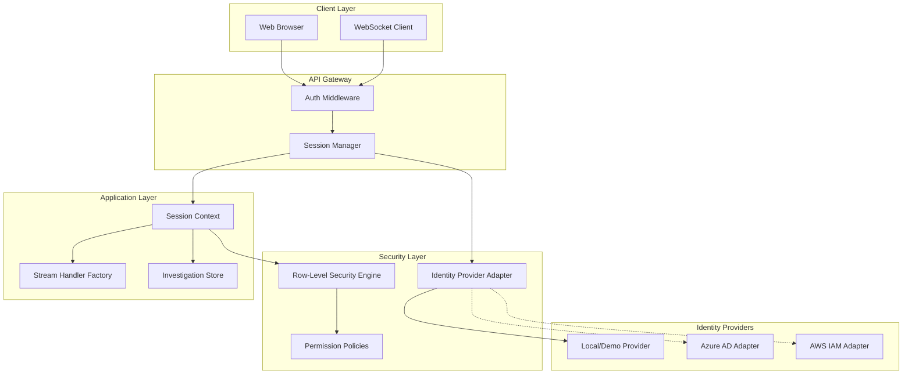

# Design Document: Session Individualization & Row-Level Security

## Overview

This design document outlines the architecture for implementing session individualization and row-level security in the DS-Star Multi-Agent System. The implementation addresses critical vulnerabilities (VULN-001, VULN-002, VULN-003) by eliminating global state, introducing request-scoped contexts, and providing a pluggable security framework.

The system operates in "Open Access Mode" by default, maintaining full backward compatibility while establishing the infrastructure for future Azure AD and AWS IAM integration.

## Architecture



## Components and Interfaces

### 1. Session Manager (`src/security/session_manager.py`)

Manages user sessions with cryptographically secure tokens and isolated contexts.

```python
from dataclasses import dataclass, field
from typing import Optional, Dict, Any
from datetime import datetime, timedelta
import secrets
import hashlib

@dataclass
class SessionContext:
    """Request-scoped session context - never stored in global state."""
    session_id: str
    user_id: str
    identity: Dict[str, Any]
    permissions: Dict[str, Any]
    data_scope: str  # "station", "region", "company"
    station: Optional[str] = None
    created_at: datetime = field(default_factory=datetime.utcnow)
    expires_at: Optional[datetime] = None
    
    def is_expired(self) -> bool:
        if self.expires_at is None:
            return False
        return datetime.utcnow() > self.expires_at

class SessionManager:
    """Thread-safe session manager using async-safe storage."""
    
    def __init__(self, 
                 identity_provider: "IdentityProviderAdapter",
                 session_ttl_hours: int = 24,
                 open_access_mode: bool = True):
        self._identity_provider = identity_provider
        self._session_ttl = timedelta(hours=session_ttl_hours)
        self._open_access_mode = open_access_mode
        # Session storage - keyed by session_id
        # In production, use Redis or similar distributed cache
        self._sessions: Dict[str, SessionContext] = {}
    
    def create_session(self, user_id: str, identity: Dict[str, Any]) -> SessionContext:
        """Create a new isolated session context."""
        session_id = self._generate_session_token()
        permissions = self._identity_provider.get_permissions(user_id)
        
        context = SessionContext(
            session_id=session_id,
            user_id=user_id,
            identity=identity,
            permissions=permissions if not self._open_access_mode else {"*": "*"},
            data_scope="company" if self._open_access_mode else permissions.get("scope", "station"),
            station=identity.get("station"),
            expires_at=datetime.utcnow() + self._session_ttl
        )
        self._sessions[session_id] = context
        return context
    
    def get_session(self, session_id: str) -> Optional[SessionContext]:
        """Retrieve session context by ID."""
        context = self._sessions.get(session_id)
        if context and context.is_expired():
            self._sessions.pop(session_id, None)
            return None
        return context
    
    def update_identity(self, session_id: str, identity: Dict[str, Any]) -> Optional[SessionContext]:
        """Update identity for a specific session only."""
        context = self.get_session(session_id)
        if not context:
            return None
        # Create new context with updated identity (immutable pattern)
        new_context = SessionContext(
            session_id=context.session_id,
            user_id=identity.get("id", context.user_id),
            identity=identity,
            permissions=context.permissions,
            data_scope=context.data_scope,
            station=identity.get("station"),
            created_at=context.created_at,
            expires_at=context.expires_at
        )
        self._sessions[session_id] = new_context
        return new_context
    
    def invalidate_session(self, session_id: str) -> bool:
        """Remove a session."""
        return self._sessions.pop(session_id, None) is not None
    
    def _generate_session_token(self) -> str:
        """Generate cryptographically secure session token."""
        return secrets.token_urlsafe(32)
```

### 2. Identity Provider Adapter (`src/security/identity_provider.py`)

Pluggable interface for authentication providers.

```python
from abc import ABC, abstractmethod
from typing import Dict, Any, Optional, List
from dataclasses import dataclass
from enum import Enum

class ProviderType(Enum):
    LOCAL = "local"
    AZURE_AD = "azure_ad"
    AWS_IAM = "aws_iam"

@dataclass
class UserAttributes:
    """Standardized user attributes from any provider."""
    user_id: str
    name: str
    email: Optional[str]
    roles: List[str]
    groups: List[str]
    station: Optional[str]
    region: Optional[str]
    custom_attributes: Dict[str, Any]

class IdentityProviderAdapter(ABC):
    """Abstract base for identity providers."""
    
    @abstractmethod
    def validate_token(self, token: str) -> Optional[UserAttributes]:
        """Validate token and extract user attributes."""
        pass
    
    @abstractmethod
    def get_permissions(self, user_id: str) -> Dict[str, Any]:
        """Get permission policy for user."""
        pass
    
    @abstractmethod
    def get_data_scope(self, user_id: str) -> str:
        """Get data scope level for user."""
        pass

class LocalIdentityProvider(IdentityProviderAdapter):
    """Local/demo identity provider for development."""
    
    def __init__(self, demo_identities: List[Dict[str, Any]]):
        self._identities = {i["id"]: i for i in demo_identities}
        self._open_access = True  # Default to open access
    
    def validate_token(self, token: str) -> Optional[UserAttributes]:
        """For local provider, token is the user_id."""
        identity = self._identities.get(token)
        if not identity:
            return None
        return UserAttributes(
            user_id=identity["id"],
            name=identity["name"],
            email=identity.get("email"),
            roles=[identity.get("role", "user")],
            groups=[],
            station=identity.get("station"),
            region=identity.get("region"),
            custom_attributes={}
        )
    
    def get_permissions(self, user_id: str) -> Dict[str, Any]:
        """Return open permissions for local provider."""
        return {"*": "*", "scope": "company"}
    
    def get_data_scope(self, user_id: str) -> str:
        """Return company-wide scope for local provider."""
        return "company"

# Future Azure AD implementation stub
class AzureADProvider(IdentityProviderAdapter):
    """
    Azure AD identity provider for enterprise SSO.
    
    Integration Points:
    - OIDC/OAuth2 token validation via MSAL
    - Group membership -> Permission mapping
    - Custom claims -> Data scope mapping
    
    Configuration:
    - AZURE_AD_TENANT_ID: Azure AD tenant
    - AZURE_AD_CLIENT_ID: Application registration ID
    - AZURE_AD_CLIENT_SECRET: Application secret
    - AZURE_AD_AUTHORITY: Login authority URL
    """
    
    def __init__(self, config: Dict[str, str]):
        self._tenant_id = config.get("AZURE_AD_TENANT_ID")
        self._client_id = config.get("AZURE_AD_CLIENT_ID")
        # MSAL client would be initialized here
        raise NotImplementedError("Azure AD integration pending")
    
    def validate_token(self, token: str) -> Optional[UserAttributes]:
        # Would use MSAL to validate JWT and extract claims
        raise NotImplementedError("Azure AD integration pending")
    
    def get_permissions(self, user_id: str) -> Dict[str, Any]:
        # Would map Azure AD groups to permission policies
        raise NotImplementedError("Azure AD integration pending")
    
    def get_data_scope(self, user_id: str) -> str:
        # Would extract scope from Azure AD custom claims
        raise NotImplementedError("Azure AD integration pending")

# Future AWS IAM implementation stub
class AWSIAMProvider(IdentityProviderAdapter):
    """
    AWS IAM identity provider for AWS-native authentication.
    
    Integration Points:
    - STS token validation via boto3
    - IAM role -> Permission mapping
    - IAM policy -> Data scope mapping
    
    Configuration:
    - AWS_REGION: AWS region
    - AWS_ROLE_ARN: Role to assume for validation
    - AWS_IDENTITY_POOL_ID: Cognito identity pool (optional)
    """
    
    def __init__(self, config: Dict[str, str]):
        self._region = config.get("AWS_REGION")
        self._role_arn = config.get("AWS_ROLE_ARN")
        # boto3 client would be initialized here
        raise NotImplementedError("AWS IAM integration pending")
    
    def validate_token(self, token: str) -> Optional[UserAttributes]:
        # Would use STS to validate and extract identity
        raise NotImplementedError("AWS IAM integration pending")
    
    def get_permissions(self, user_id: str) -> Dict[str, Any]:
        # Would map IAM roles to permission policies
        raise NotImplementedError("AWS IAM integration pending")
    
    def get_data_scope(self, user_id: str) -> str:
        # Would extract scope from IAM policy tags
        raise NotImplementedError("AWS IAM integration pending")
```

### 3. Row-Level Security Engine (`src/security/rls_engine.py`)

Filters data access based on user permissions and data scope.

```python
from dataclasses import dataclass
from typing import Dict, Any, List, Optional, Callable
from enum import Enum
import logging

logger = logging.getLogger(__name__)

class DataScope(Enum):
    STATION = "station"
    REGION = "region"
    COMPANY = "company"

@dataclass
class PermissionPolicy:
    """Defines access rules for a data entity."""
    entity_type: str  # e.g., "investigation", "kpi_data"
    allowed_scopes: List[DataScope]
    owner_field: str  # Field containing owner identifier
    scope_field: str  # Field containing scope identifier (station, region)
    custom_filter: Optional[Callable[[Dict, "SessionContext"], bool]] = None

class RowLevelSecurityEngine:
    """Filters data based on user permissions and scope."""
    
    def __init__(self, open_access_mode: bool = True):
        self._open_access_mode = open_access_mode
        self._policies: Dict[str, PermissionPolicy] = {}
        self._audit_log: List[Dict[str, Any]] = []
    
    def register_policy(self, policy: PermissionPolicy) -> None:
        """Register a permission policy for an entity type."""
        self._policies[policy.entity_type] = policy
    
    def filter_results(self, 
                       entity_type: str,
                       results: List[Dict[str, Any]], 
                       context: "SessionContext") -> List[Dict[str, Any]]:
        """Filter results based on user's permissions."""
        # Log access attempt
        self._log_access(entity_type, len(results), context)
        
        # Bypass filtering in open access mode
        if self._open_access_mode:
            return results
        
        policy = self._policies.get(entity_type)
        if not policy:
            # No policy = open access (default)
            return results
        
        filtered = []
        for item in results:
            if self._check_access(item, policy, context):
                filtered.append(item)
        
        return filtered
    
    def check_single_access(self,
                            entity_type: str,
                            item: Dict[str, Any],
                            context: "SessionContext") -> bool:
        """Check if user can access a single item."""
        self._log_access(entity_type, 1, context)
        
        if self._open_access_mode:
            return True
        
        policy = self._policies.get(entity_type)
        if not policy:
            return True
        
        return self._check_access(item, policy, context)
    
    def _check_access(self, 
                      item: Dict[str, Any], 
                      policy: PermissionPolicy,
                      context: "SessionContext") -> bool:
        """Internal access check logic."""
        # Custom filter takes precedence
        if policy.custom_filter:
            return policy.custom_filter(item, context)
        
        # Check ownership
        owner = item.get(policy.owner_field)
        if owner == context.user_id:
            return True
        
        # Check scope
        user_scope = DataScope(context.data_scope)
        item_scope_value = item.get(policy.scope_field)
        
        if user_scope == DataScope.COMPANY:
            return True
        elif user_scope == DataScope.REGION:
            # User can see items in their region
            return item_scope_value == context.identity.get("region")
        elif user_scope == DataScope.STATION:
            # User can only see items at their station
            return item_scope_value == context.station
        
        return False
    
    def _log_access(self, entity_type: str, count: int, context: "SessionContext") -> None:
        """Log access decision for audit."""
        self._audit_log.append({
            "timestamp": datetime.utcnow().isoformat(),
            "user_id": context.user_id,
            "session_id": context.session_id,
            "entity_type": entity_type,
            "items_requested": count,
            "data_scope": context.data_scope,
            "open_access_mode": self._open_access_mode
        })
        logger.info(f"RLS: user={context.user_id} entity={entity_type} count={count} scope={context.data_scope}")
```

### 4. Stream Handler Factory (`src/handlers/stream_handler_factory.py`)

Creates request-scoped stream handlers.

```python
from typing import Optional
from src.handlers.stream_handler import InvestigationStreamHandler

class StreamHandlerFactory:
    """Factory for creating request-scoped stream handlers."""
    
    @staticmethod
    def create_websocket_handler(websocket, session_context: "SessionContext") -> InvestigationStreamHandler:
        """Create a new stream handler bound to a specific WebSocket and session."""
        handler = WebSocketStreamHandler(websocket, session_context.session_id)
        return handler

class WebSocketStreamHandler(InvestigationStreamHandler):
    """WebSocket-specific stream handler - request-scoped, never shared."""
    
    def __init__(self, websocket, session_id: str):
        super().__init__()
        self._websocket = websocket
        self._session_id = session_id
        self._closed = False
    
    async def send(self, message: dict) -> None:
        """Send message to this specific WebSocket only."""
        if self._closed:
            return
        try:
            await self._websocket.send_json(message)
        except Exception:
            self._closed = True
    
    def close(self) -> None:
        """Mark handler as closed - cleanup."""
        self._closed = True
```

### 5. Session-Isolated Investigation Store (`src/data/investigation_store.py`)

Stores investigations with session/user association.

```python
from typing import Dict, List, Optional, Any
from datetime import datetime
import threading

class InvestigationStore:
    """Thread-safe investigation storage with session isolation."""
    
    def __init__(self, rls_engine: "RowLevelSecurityEngine"):
        self._investigations: Dict[str, Dict[str, Any]] = {}
        self._rls_engine = rls_engine
        self._lock = threading.RLock()
    
    def create(self, 
               investigation_id: str,
               data: Dict[str, Any],
               context: "SessionContext") -> Dict[str, Any]:
        """Create investigation associated with session context."""
        with self._lock:
            record = {
                **data,
                "id": investigation_id,
                "created_by": context.user_id,
                "session_id": context.session_id,
                "station": context.station,
                "created_at": datetime.utcnow().isoformat(),
            }
            self._investigations[investigation_id] = record
            return record
    
    def get(self, 
            investigation_id: str, 
            context: "SessionContext") -> Optional[Dict[str, Any]]:
        """Get investigation if user has access."""
        with self._lock:
            inv = self._investigations.get(investigation_id)
            if not inv:
                return None
            if not self._rls_engine.check_single_access("investigation", inv, context):
                return None  # Access denied
            return inv
    
    def list(self, 
             context: "SessionContext",
             station: Optional[str] = None) -> List[Dict[str, Any]]:
        """List investigations user has access to."""
        with self._lock:
            all_invs = list(self._investigations.values())
            if station:
                all_invs = [i for i in all_invs if i.get("station") == station]
            return self._rls_engine.filter_results("investigation", all_invs, context)
    
    def update(self,
               investigation_id: str,
               updates: Dict[str, Any],
               context: "SessionContext") -> Optional[Dict[str, Any]]:
        """Update investigation if user has access."""
        with self._lock:
            inv = self.get(investigation_id, context)
            if not inv:
                return None
            inv.update(updates)
            self._investigations[investigation_id] = inv
            return inv
```

## Data Models

```python
from dataclasses import dataclass, field
from typing import Optional, Dict, Any, List
from datetime import datetime
from enum import Enum

class AccessDecision(Enum):
    ALLOWED = "allowed"
    DENIED = "denied"
    OPEN_ACCESS = "open_access"

@dataclass
class AuditLogEntry:
    """Audit log entry for access decisions."""
    timestamp: datetime
    session_id: str
    user_id: str
    action: str  # "read", "write", "delete"
    entity_type: str
    entity_id: Optional[str]
    decision: AccessDecision
    reason: str
    metadata: Dict[str, Any] = field(default_factory=dict)

@dataclass
class SecurityConfig:
    """Security configuration."""
    open_access_mode: bool = True
    session_ttl_hours: int = 24
    identity_provider: str = "local"  # "local", "azure_ad", "aws_iam"
    enable_audit_logging: bool = True
    
    # Azure AD settings (for future use)
    azure_ad_tenant_id: Optional[str] = None
    azure_ad_client_id: Optional[str] = None
    
    # AWS IAM settings (for future use)
    aws_region: Optional[str] = None
    aws_role_arn: Optional[str] = None
```

## Correctness Properties

*A property is a characteristic or behavior that should hold true across all valid executions of a system-essentially, a formal statement about what the system should do. Properties serve as the bridge between human-readable specifications and machine-verifiable correctness guarantees.*

### Property 1: Session Token Uniqueness

*For any* set of N session creations, all generated session tokens SHALL be unique and cryptographically secure (minimum 256 bits of entropy).

**Validates: Requirements 1.1**

### Property 2: Session Isolation

*For any* two concurrent sessions A and B, modifying the identity in session A SHALL NOT affect the identity or state in session B.

**Validates: Requirements 1.2, 1.3, 1.4**

### Property 3: Invalid Token Rejection

*For any* invalid, expired, or malformed session token, the Session_Manager SHALL return None (triggering 401 response).

**Validates: Requirements 1.5**

### Property 4: Request-Scoped Stream Handler

*For any* WebSocket query, a new stream handler instance SHALL be created, and no global stream handler references SHALL be modified.

**Validates: Requirements 2.1, 2.2**

### Property 5: Stream Handler Message Routing

*For any* set of N concurrent WebSocket connections, messages sent through stream handler H_i SHALL only be received by client C_i.

**Validates: Requirements 2.3, 2.4, 2.5**

### Property 6: Data Ownership Enforcement

*For any* investigation created by user U, when row-level security is enabled, only user U (or users with appropriate scope) SHALL be able to access that investigation.

**Validates: Requirements 3.1, 3.2, 3.3, 3.4**

### Property 7: Open Access Mode Behavior

*For any* data query in Open_Access_Mode, all authenticated users SHALL receive unfiltered results, while still maintaining separate session contexts.

**Validates: Requirements 3.5, 6.2, 6.3, 6.5**

### Property 8: Permission Policy Application

*For any* data query with row-level security enabled, the results SHALL be filtered according to the user's Permission_Policy and Data_Scope.

**Validates: Requirements 4.2, 4.4, 4.6**

### Property 9: Audit Logging Completeness

*For any* data access decision (allowed or denied), an audit log entry SHALL be created containing user_id, session_id, entity_type, and decision.

**Validates: Requirements 4.5**

### Property 10: Concurrent Request Safety

*For any* set of concurrent requests, no module-level global variables SHALL be used for request-specific state, and no race conditions SHALL cause data corruption.

**Validates: Requirements 7.1, 7.2, 7.4**

### Property 11: Identity Attribute Extraction

*For any* valid identity provider token, the adapter SHALL extract and return standardized UserAttributes including user_id, roles, and station.

**Validates: Requirements 5.6**

## Error Handling

| Error Condition | Handling Strategy |
|----------------|-------------------|
| Invalid session token | Return 401 Unauthorized, log attempt |
| Expired session | Return 401 Unauthorized, cleanup session |
| Access denied (RLS) | Return 403 Forbidden, log in audit |
| Identity provider unavailable | Fall back to cached session, log warning |
| Concurrent modification | Use locks, retry with backoff |
| WebSocket disconnect | Cleanup handler, preserve investigation state |
| Configuration error | Fail fast on startup, log error |

## Testing Strategy

### Unit Tests

- Session token generation uniqueness
- Session context isolation
- Permission policy evaluation
- Data scope filtering
- Audit log creation

### Property-Based Tests

Property-based tests using `hypothesis` library:

```python
from hypothesis import given, strategies as st

# Property 1: Session Token Uniqueness
@given(st.integers(min_value=2, max_value=100))
def test_session_tokens_unique(n):
    """For any N sessions, all tokens are unique."""
    manager = SessionManager(LocalIdentityProvider([]))
    tokens = set()
    for i in range(n):
        ctx = manager.create_session(f"user_{i}", {"id": f"user_{i}"})
        assert ctx.session_id not in tokens
        tokens.add(ctx.session_id)

# Property 2: Session Isolation
@given(st.text(min_size=1), st.text(min_size=1))
def test_session_isolation(identity_a, identity_b):
    """Modifying session A does not affect session B."""
    manager = SessionManager(LocalIdentityProvider([]))
    ctx_a = manager.create_session("user_a", {"id": "a", "name": identity_a})
    ctx_b = manager.create_session("user_b", {"id": "b", "name": identity_b})
    
    # Modify A
    manager.update_identity(ctx_a.session_id, {"id": "a", "name": "changed"})
    
    # B should be unchanged
    ctx_b_after = manager.get_session(ctx_b.session_id)
    assert ctx_b_after.identity["name"] == identity_b
```

### Test Configuration

- Framework: pytest with hypothesis
- Minimum iterations: 100 per property test
- Tag format: `Feature: session-row-level-security, Property N: <description>`

## Future Integration: Azure AD

### Configuration

```yaml
# config/security.yaml
identity_provider: azure_ad
azure_ad:
  tenant_id: ${AZURE_AD_TENANT_ID}
  client_id: ${AZURE_AD_CLIENT_ID}
  client_secret: ${AZURE_AD_CLIENT_SECRET}
  authority: https://login.microsoftonline.com/${AZURE_AD_TENANT_ID}
```

### Group-to-Permission Mapping

| Azure AD Group | Permission Policy | Data Scope |
|---------------|-------------------|------------|
| DS-Star-Admins | Full access | Company |
| DS-Star-RegionalManagers | Regional data | Region |
| DS-Star-StationManagers | Station data | Station |
| DS-Star-Analysts | Read-only | Station |

### Migration Steps

1. Register application in Azure AD
2. Configure OIDC endpoints
3. Map Azure AD groups to permission policies
4. Update `identity_provider` config to `azure_ad`
5. Test with pilot users
6. Roll out to all users

## Future Integration: AWS IAM

### Configuration

```yaml
# config/security.yaml
identity_provider: aws_iam
aws_iam:
  region: ${AWS_REGION}
  role_arn: ${AWS_ROLE_ARN}
  identity_pool_id: ${AWS_COGNITO_IDENTITY_POOL_ID}
```

### Role-to-Permission Mapping

| IAM Role | Permission Policy | Data Scope |
|----------|-------------------|------------|
| DSStarAdmin | Full access | Company |
| DSStarRegionalManager | Regional data | Region |
| DSStarStationManager | Station data | Station |
| DSStarAnalyst | Read-only | Station |

### Migration Steps

1. Create IAM roles with appropriate policies
2. Configure Cognito identity pool (optional)
3. Map IAM roles to permission policies
4. Update `identity_provider` config to `aws_iam`
5. Test with pilot users
6. Roll out to all users

## Threats Not Covered & Resolution Plan

### 1. Session Fixation Attacks
**Threat**: Attacker could potentially fixate a session ID before authentication.
**Resolution**: Regenerate session ID after successful authentication. Add to Requirement 1.

### 2. Token Theft via XSS
**Threat**: Session tokens could be stolen via cross-site scripting.
**Resolution**: Use HttpOnly cookies for session tokens, implement CSP headers. Requires frontend changes.

### 3. Replay Attacks
**Threat**: Captured tokens could be replayed.
**Resolution**: Implement token binding to client fingerprint, add nonce to requests.

### 4. Privilege Escalation via API
**Threat**: Users could attempt to access admin endpoints.
**Resolution**: Implement role-based endpoint authorization (separate from RLS).

### 5. Data Exfiltration via Bulk Export
**Threat**: Authorized users could export large amounts of data.
**Resolution**: Implement rate limiting and data export auditing.

### 6. Insider Threat - Admin Abuse
**Threat**: Admins with company-wide access could abuse privileges.
**Resolution**: Implement admin action logging, require MFA for sensitive operations.

### 7. Supply Chain - Dependency Vulnerabilities
**Threat**: Security libraries could have vulnerabilities.
**Resolution**: Pin dependency versions, regular security audits (covered by existing spec).
