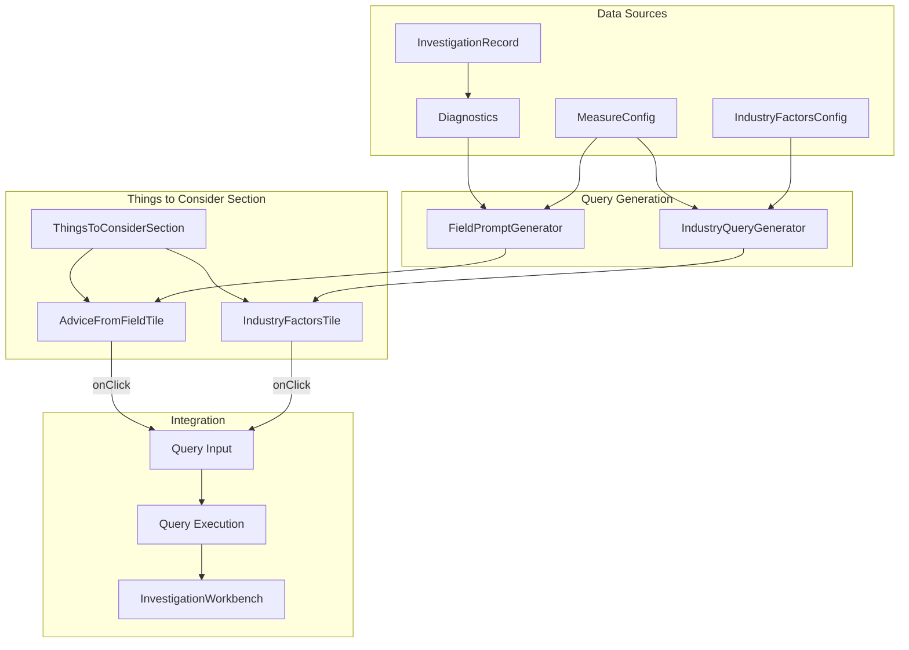

# Things to Consider - Design Document

## Overview

This design document describes the architecture for the "Things to Consider" feature - a guided query suggestion section that helps station managers learn to effectively use DS-Star for causal analysis. The feature consists of two vertically stacked tiles: "Advice from the Field" (dynamic suggestions based on investigation findings) and "Common Industry Causal Factors" (standard factors to check based on KPI type).

## Architecture



## Components and Interfaces

### Component Hierarchy

```
InvestigationPage
├── ThingsToConsiderSection
│   ├── AdviceFromFieldTile
│   │   ├── TileHeader (icon + title + subtitle)
│   │   └── SuggestionChipList
│   │       └── SuggestionChip[]
│   └── IndustryFactorsTile
│       ├── TileHeader (icon + title + subtitle)
│       └── FactorChipList
│           └── FactorChip[]
└── InvestigationWorkbench (existing)
```

### ThingsToConsiderSection Props

```typescript
interface ThingsToConsiderSectionProps {
  investigation: InvestigationRecord | null
  kpiId: string
  station: string
  window: 'weekly' | 'daily'
  onExecuteQuery: (query: string) => void
  isProcessing?: boolean
}
```

### AdviceFromFieldTile Props

```typescript
interface AdviceFromFieldTileProps {
  diagnostics: InvestigationDiagnostic[]
  kpiId: string
  station: string
  window: 'weekly' | 'daily'
  onSelectPrompt: (query: string) => void
  isProcessing?: boolean
}
```

### IndustryFactorsTile Props

```typescript
interface IndustryFactorsTileProps {
  kpiId: string
  station: string
  window: 'weekly' | 'daily'
  onSelectFactor: (query: string) => void
  isProcessing?: boolean
}
```

### SuggestionChip Props

```typescript
interface SuggestionChipProps {
  label: string
  query: string
  icon?: React.ReactNode
  onClick: (query: string) => void
  isLoading?: boolean
  disabled?: boolean
}
```

## Data Models

### Field Advice Suggestion

```typescript
interface FieldAdviceSuggestion {
  id: string
  label: string
  query: string
  source: 'stage_change' | 'yoy_delta' | 'peer_comparison' | 'signal_pattern'
  confidence?: number
  relatedStation?: string
}
```

### Industry Factor

```typescript
interface IndustryFactor {
  id: string
  category: string
  label: string
  description: string
  queryTemplate: string
  relevantKpis: string[]
  priority: number
}
```

### Industry Factors Configuration

```typescript
const INDUSTRY_FACTORS: IndustryFactor[] = [
  // Weather & Environmental
  {
    id: 'weather_impact',
    category: 'Environmental',
    label: 'Weather Impact',
    description: 'Analyze weather-related delays and disruptions',
    queryTemplate: 'Analyze weather impact on {kpi} at {station}. Were there severe weather events during the signal period?',
    relevantKpis: ['otp_mx_ratio', 'dispatch_reliability', 'cancellation_rate', 'completion_factor'],
    priority: 1,
  },
  // Staffing & Resources
  {
    id: 'staffing_levels',
    category: 'Resources',
    label: 'Staffing Levels',
    description: 'Check maintenance crew availability and scheduling',
    queryTemplate: 'Analyze staffing levels at {station} during the signal period. Were there crew shortages or scheduling issues?',
    relevantKpis: ['otp_mx_ratio', 'mttr', 'dispatch_reliability'],
    priority: 2,
  },
  // Equipment & Fleet
  {
    id: 'fleet_age',
    category: 'Fleet',
    label: 'Fleet Age Analysis',
    description: 'Examine aircraft age and reliability correlation',
    queryTemplate: 'Is there correlation between aircraft age and {kpi} issues at {station}? Compare older vs newer fleet.',
    relevantKpis: ['dispatch_reliability', 'mtbf', 'aog_rate', 'otp_mx_ratio'],
    priority: 3,
  },
  // Parts & Supply Chain
  {
    id: 'parts_availability',
    category: 'Supply Chain',
    label: 'Parts Availability',
    description: 'Check parts stockouts and supply chain issues',
    queryTemplate: 'Were there parts availability issues at {station} during the signal period? Which parts caused delays?',
    relevantKpis: ['mttr', 'aog_rate', 'dispatch_reliability', 'otp_mx_ratio'],
    priority: 2,
  },
  // Process & Procedures
  {
    id: 'procedure_changes',
    category: 'Process',
    label: 'Procedure Changes',
    description: 'Check for recent process or procedure changes',
    queryTemplate: 'Were there any procedure or process changes at {station} that coincide with the {kpi} signal?',
    relevantKpis: ['*'], // Relevant to all KPIs
    priority: 4,
  },
  // Training & Competency
  {
    id: 'training_gaps',
    category: 'Training',
    label: 'Training & Competency',
    description: 'Analyze technician training and skill gaps',
    queryTemplate: 'Are there training or competency gaps at {station} that could explain the {kpi} degradation?',
    relevantKpis: ['mttr', 'dispatch_reliability', 'otp_mx_ratio'],
    priority: 3,
  },
  // Vendor & External
  {
    id: 'vendor_performance',
    category: 'External',
    label: 'Vendor Performance',
    description: 'Check third-party vendor and supplier issues',
    queryTemplate: 'Were there vendor or supplier performance issues affecting {kpi} at {station}?',
    relevantKpis: ['parts_availability', 'mttr', 'aog_rate'],
    priority: 4,
  },
  // Scheduling & Planning
  {
    id: 'schedule_changes',
    category: 'Planning',
    label: 'Schedule Changes',
    description: 'Analyze flight schedule or maintenance schedule changes',
    queryTemplate: 'Were there schedule changes at {station} that impacted {kpi}? Compare before and after schedules.',
    relevantKpis: ['otp_mx_ratio', 'utilization', 'completion_factor'],
    priority: 3,
  },
]
```

### Field Prompt Generation Logic

```typescript
function generateFieldAdvice(
  diagnostics: InvestigationDiagnostic[],
  kpiId: string,
  station: string,
  window: 'weekly' | 'daily'
): FieldAdviceSuggestion[] {
  const suggestions: FieldAdviceSuggestion[] = []
  
  for (const diag of diagnostics) {
    // Stage change suggestions
    if (diag.stage_change) {
      suggestions.push({
        id: `stage_${diag.name}`,
        label: `What changed when the stage shifted?`,
        query: `The SPC chart shows a stage change around ${diag.selected_t}. What operational changes occurred at ${station} at that time that could explain the ${kpiId} shift?`,
        source: 'stage_change',
        confidence: diag.confidence,
      })
    }
    
    // YoY delta suggestions
    if (diag.yoy_delta && Math.abs(diag.yoy_delta) > 0.05) {
      const direction = diag.yoy_delta > 0 ? 'increase' : 'decrease'
      suggestions.push({
        id: `yoy_${diag.name}`,
        label: `Why the ${Math.abs(diag.yoy_delta * 100).toFixed(0)}% YoY ${direction}?`,
        query: `${kpiId} shows a ${Math.abs(diag.yoy_delta * 100).toFixed(1)}% year-over-year ${direction} at ${station}. What factors explain this change compared to last year?`,
        source: 'yoy_delta',
        confidence: diag.confidence,
      })
    }
    
    // Peer comparison suggestions
    if (diag.peer_mean !== undefined) {
      const diff = (diag.selected_value || 0) - diag.peer_mean
      if (Math.abs(diff) > 0.02) {
        const comparison = diff > 0 ? 'above' : 'below'
        suggestions.push({
          id: `peer_${diag.name}`,
          label: `Why different from peer stations?`,
          query: `${station} is performing ${comparison} peer average for ${kpiId}. What factors at ${station} differ from peer stations that could explain this?`,
          source: 'peer_comparison',
          confidence: diag.confidence,
        })
      }
    }
  }
  
  return suggestions
}
```

## Correctness Properties

*A property is a characteristic or behavior that should hold true across all valid executions of a system-essentially, a formal statement about what the system should do. Properties serve as the bridge between human-readable specifications and machine-verifiable correctness guarantees.*

### Property 1: Diagnostic-based prompt generation

*For any* set of investigation diagnostics containing stage changes, YoY deltas, or peer comparison data, the generated field advice prompts should include at least one suggestion relevant to each diagnostic finding type present.

**Validates: Requirements 2.3, 5.1, 5.2, 5.3**

### Property 2: KPI-specific factor relevance

*For any* KPI identifier, the industry factors displayed should only include factors where the KPI is in the factor's `relevantKpis` list (or the factor applies to all KPIs), and factors should be sorted by priority (lower priority number first).

**Validates: Requirements 3.3, 3.5, 5.4, 5.5**

### Property 3: Query context inclusion

*For any* generated query (from field advice or industry factors), the query string should contain the station identifier, KPI identifier, and be contextually relevant to the investigation.

**Validates: Requirements 4.3**

### Property 4: Click-to-execute behavior

*For any* suggestion chip click event, the `onExecuteQuery` callback should be invoked with the chip's associated query string.

**Validates: Requirements 4.1, 4.2**

### Property 5: Accessibility labels

*For any* rendered suggestion chip, the element should have an `aria-label` attribute that describes the action (e.g., "Run query: [query text]").

**Validates: Requirements 6.4**

## Error Handling

### Empty State Handling

- When no diagnostics are available, display: "No field suggestions available yet. Run an analysis to generate suggestions."
- When no industry factors match the KPI, display generic factors applicable to all KPIs

### Query Execution Errors

- Display error toast with retry option
- Keep chip in non-loading state to allow retry
- Log error details for debugging

### Loading States

- Show spinner on clicked chip during query execution
- Disable all chips while a query is processing
- Show skeleton loaders during initial data fetch

## Testing Strategy

### Unit Tests

- Test `generateFieldAdvice` function with various diagnostic combinations
- Test `getRelevantFactors` function with different KPI types
- Test query template interpolation with various contexts
- Test component rendering with different prop combinations

### Property-Based Tests

- Use fast-check to generate random diagnostic arrays and verify prompt generation properties
- Generate random KPI identifiers and verify factor filtering/sorting
- Generate random investigation contexts and verify query context inclusion

### Integration Tests

- Test click-to-execute flow from chip click to query execution
- Test section integration with InvestigationPage
- Test responsive layout behavior

### Accessibility Tests

- Verify keyboard navigation through chips
- Verify screen reader announcements
- Verify focus management
